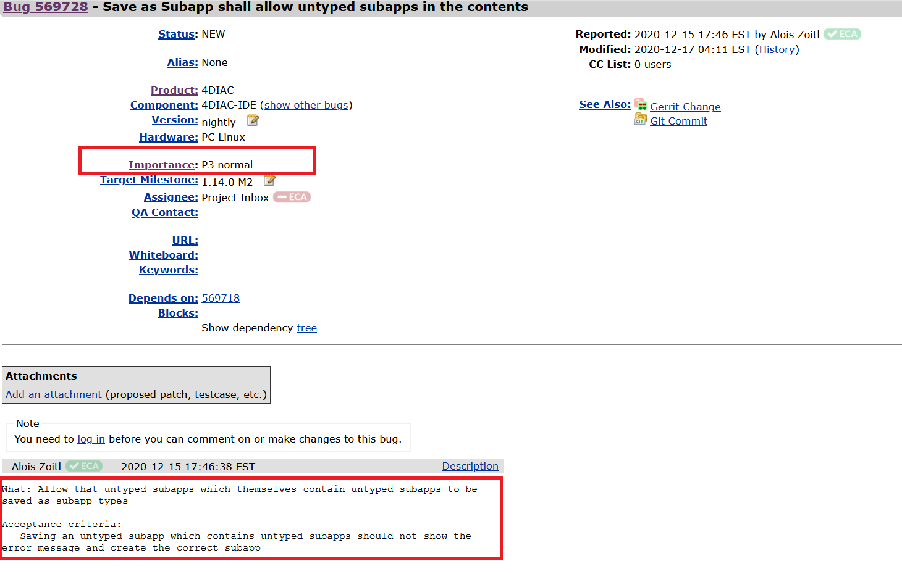

# 软件需求工程实验二 实验报告


## 1. 小组成员及得分分配

| 学号      | 姓名   | 得分比 |
| --------- | ------ | ------ |
| 181830014 | 柴致远 | 20%    |
| 181180215 | 朱景舟 | 20%    |
| 181860061 | 陆逸麟 | 20%    |
| 181860125 | 杨震浩 | 20%    |
| 171860588 | 史文泰 | 20%    |


## 2. 实验目的

* 对`Eclipse`上的缺陷报告数据进行提取。
* 通过**机器学习多分类**的方法将缺陷分成 `P1`~`P5` 五个等级。用**手工分类**的方法将缺陷分为`Critical`，`Block`，`Major`，`Normal`，`Minor`五个等级。
* 判断两种分类方法各自的准确性，择优选取。


## 3. 实验数据

* **来源**：https://bugs.eclipse.org/bugs/


## 4. 实验方法

### 4.1. 数据抓取

* 数据来源 https://bugs.eclipse.org/bugs/  上的每条Bug报告均具有`P1`~`P5`的等级标签，每个等级内按照Bug严重程度的不同，又细分成`critical`、`enhancement`、`major`、`normal`、`trivial`的5个子等级。为了方便后续的机器学习等，我们首先使用Node.js编写了爬虫程序，分别爬取上述5*5 = 25个细类下的报告若干，保留其中的`Description`文字作为原始数据：

  

   

  

* 实际得到的结果中，部分类别内数据条数过少（这已将全站的数据纳入了爬取范围），不足以进行机器学习训练，也为人工分类带来了难度。经过综合考虑，**将属于同一等级（P1~P5）的数据合并，完成后续实验**。（但未合并的爬取结果仍然保留在`results/`目录下）

* 此部分代码详见`crawl.js`

  

### 4.2. 人工分类

* 在人工分类中，查阅资料可得`Bug`常见的分级有五种，严重程度由大到小依次为：`Critical`，`Block`，`Major`，`Normal`，`Minor`。具体程度如下：
    * `Critical`：代表系统崩溃，完全不可用，是最严重的错误，如网站无法访问，点击时出现系统错误，应用模块无法启动或退出，用户数据丢失或破坏等。需要注意的是，Bug的严重程度和他的易于修复程度并不总是一致的，如Critical类型的网页无法访问Bug可以通过修改域名的方法简单解决。
    * `Block`：系统并没有发生大规模的崩溃，但是用户的操作被卡死，无法进行下一步的操作。
    * `Major`：流程可以走通，但是关键的业务或是数据错误，影响用户的正常使用，产生了与预期不同的结果，但不会影响系统稳定性，如功能未实现，语音或数据通讯错误。
    * `Normal`：分支业务逻辑里偶尔出现不太重要的错误，不影响用户的正常使用。
    * `Minor`：无伤大雅的小问题，通常指兼容性，界面，性能缺陷，或不重要的文案错别字，样式错误等。
    
* 我们小组将五种分级的`Bug`与`bugs.eclipse.org`中的`P1`\~`P5`等级对应起来，对于网站上获得的`Bug`类型，从`P1`\~`P5`中随机挑选出一些`Bug`报告，使用手工分类的方式进行五种等级的分类，并将手工分类的结果与原先等级进行映照比对，考察手工分类的准确性。

    

### 4.3. `Sklearn`多分类

* **数据划分**
    * 在`P1`~`P5`的每一类数据中，随机取90%的数据作为训练集（`Traindata`），将剩余的**10%**的数据作为测试集（`Testdata`）

* **数据处理**
    * 在`Python`中读入爬取到的数据，将文本分词后为每个数据打上标签（`P1/P2/P3/P4/P5`），加入训练组中：

```python
def segText(inputPath):
    data_list = []
    label_list = []
    fatherLists = os.listdir(inputPath)  # 主目录
    for eachFatherDir in fatherLists:  # 遍历主目录中各个文件夹
        curPath = inputPath + "/" + eachFatherDir + "/"  # 保存主目录中每个文件夹目录，便于遍历二级文件夹
        BrotherLists = os.listdir(curPath)
        for eachChildDir in BrotherLists:
            eachPath = curPath + eachChildDir + "/"
            print(eachPath)
            childLists = os.listdir(eachPath)  # 获取每个文件夹中的各个文件
            for eachFile in childLists:  # 遍历每个文件夹中的子文件
                eachPathFile = eachPath + eachFile  # 获得每个文件路径
                content = readFile(eachPathFile)  # 调用上面函数读取内容
                result = (str(content)).replace("\r\n", "").strip()  # 删除多余空行与空格
                cutResult = jieba.cut(result)  # 默认方式分词，分词结果用空格隔开
                label_list.append(eachFatherDir)
                data_list.append(" ".join(cutResult))
    return data_list, label_list
```

* `TF-IDF` 算法
    * **TF-IDF（term frequency–inverse document frequency，词频-逆向文件频率）**是一种用于信息检索（`information retrieval`）与文本挖掘（`text mining`）的常用**加权技术**。
    * **TF-IDF**是一种统计方法，用以评估一字词对于一个文件集或一个语料库中的其中一份文件的重要程度。**字词的重要性随着它在文件中出现的次数成正比增加，但同时会随着它在语料库中出现的频率成反比下降。**
    * **TF-IDF的主要思想是**：如果某个单词在一篇文章中出现的频率TF高，并且在其他文章中很少出现，则认为此词或者短语具有很好的类别区分能力，适合用来分类。

* `sklearn`实现`TF-IDF`多分类
    * 将数据及标签保存到 `class1`~`class5` 后加入训练集，使用`sklearn`实现`TF-IDF`算法。

```python
train = [class1, class2, class3, class4, class5]
# 其他类别专用分类，该类会将文本中的词语转换为词频矩阵，矩阵元素a[i][j] 表示j词在i类文本下的词频
vectorizer = CountVectorizer(stop_words=stopWordList, min_df=0.5)
transformer = TfidfTransformer()  # 统计每个词语的tf-idf权值
cipin = vectorizer.fit_transform(train)
tfidf = transformer.fit_transform(cipin)  # tf-idf中的输入为已经处理过的词频矩阵
model = OneVsRestClassifier(svm.SVC(kernel='linear'))
train_cipin = vectorizer.transform(train_data)
train_arr = transformer.transform(train_cipin)
clf = model.fit(train_arr, train_label)
return vectorizer, transformer, clf
```


## 5. 实验结果

### 5.1. 人工分类结果

| 实际级别 | 采样个数 | Critical | Block | Major | Normal | Minor |
| -------- | -------- | -------- | ----- | ----- | ------ | ----- |
| P1       | 21       | 15       | 3     | 0     | 2      | 1     |
| P2       | 65       | 4        | 5     | 6     | 46     | 4     |
| P3       | 52       | 2        | 1     | 16    | 20     | 13    |
| P4       | 63       | 1        | 0     | 7     | 43     | 12    |
| P5       | 60       | 0        | 0     | 1     | 23     | 36    |

### 5.2. `Sklearn`分类结果

```python
def PredictText(inputPath, vectorrizer, transformer, clf):
    correct = [0, 0, 0, 0, 0, 0]
    textnum = [0, 0, 0, 0, 0, 0]
    fatherLists = os.listdir(inputPath)  # 主目录
    for eachDir in fatherLists:  # 遍历主目录中各个文件夹
        eachPath = inputPath + "/" + eachDir + "/"  # 保存主目录中每个文件夹目录，便于遍历二级文件
        childLists = os.listdir(eachPath)  # 获取每个文件夹中的各个文件
        for eachFile in childLists:  # 遍历每个文件夹中的子文件
            eachPathFile = eachPath + eachFile  # 获得每个文件路径
            content = readFile(eachPathFile)  # 调用上面函数读取内容
            result = (str(content)).replace("\r\n", "").strip()  # 删除多余空行与空格
            cutResult = jieba.cut(result)  # 默认方式分词，分词结果用空格隔开
            sentence_in = [' '.join(cutResult)]
            b = vectorizer.transform(sentence_in)
            c = transformer.transform(b)
            prd = clf.predict(c)
            print('预测类别：', prd[0])
            index = int(eachDir[1])
            textnum[index] = textnum[index] + 1
            if prd[0] == eachDir:
                correct[index] = correct[index] + 1
    for i in range(1, 6):
        print('accuracy', i, '=', float(correct[i])/float(textnum[i]))
```

结果显示为：


## 6. 结论

* **人工分类**结论：从人工分类的结果与原分级比对可以得知，`Critical`与`P1`等级、`Normal`与`P4`等级、`Minor`与`P5`等级匹配度较好；`Major`比较偏向`P3`等级，而`Block`与`P2`等级完全不匹配，`P2`级别中的`Bug`大多是`Normal`类型的`Bug`。

* `Sklean`结论：`Sklearn` 实现的 `TF-IDF` 算法整体准确率较高，在`P3`与`P4`类型缺陷数据的预测上准确率会略显不足。整体上，对于每种类型的数据，分类准确率均可达到**70%**及以上。